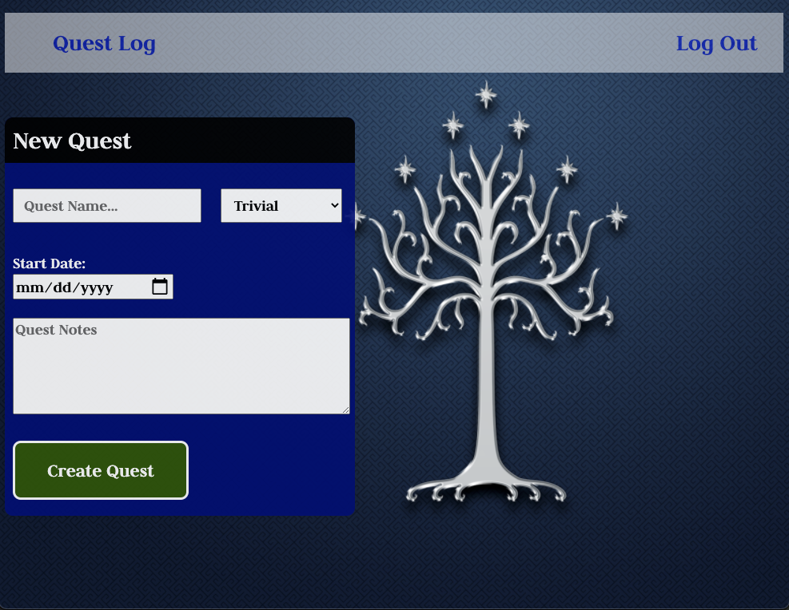

# Level Up
This app allows users to create and keep track of their quests - in real-life, video games, or table-top role-playing games - in order to organize and prioritize tasks efficiently. 

---
## Technologies Used:
* JavaScript
* CSS
* MongoDB (Atlas)
* Node
* Express
* Mongoose
* Heroku
* Google OAuth
---
## Getting Started
* Launch the app here: [Level Up](https://level-up-ga.herokuapp.com/)

* [Trello Board](https://level-up-ga.herokuapp.com/)

* Wireframes:

