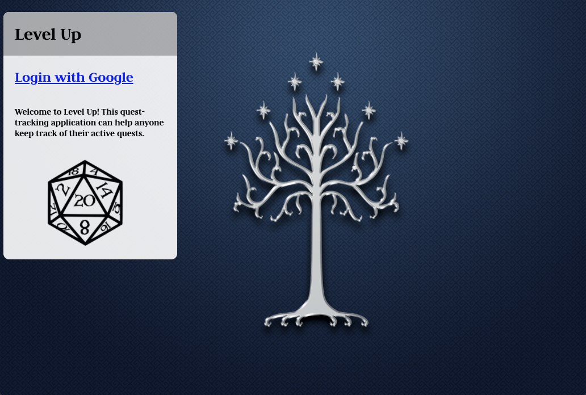
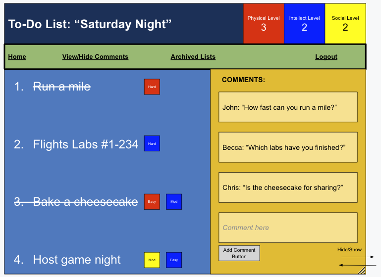

# Level Up
This app allows users to create and keep track of their quests - in real-life, video games, or table-top role-playing games - in order to organize and prioritize tasks efficiently. 

---
## Technologies Used:
* JavaScript
* CSS
* MongoDB (Atlas)
* Node
* Express
* Mongoose
* Heroku
* Google OAuth
---
## Getting Started
* Launch the app here: [Level Up](https://level-up-ga.herokuapp.com/)

* [Trello Board](https://trello.com/b/i6O0sDQD/level-up)

* Wireframes:

---
## Next Steps
I'm far from mastering this skill and this entire project was so daunting to me, I had to place so many features and core functionalities into my project's icebox. When I have the time to revisit this app, I'd love to implement the following changes:
1. Filter feature.
2. Allowing the User to pick an avatar or upload a selfie.
3. Timestamps for comments.
4. Display Quest Creator on the Quest Log page.
5. Customized themes.
6. User Settings.
7. Notifications.
8. Friends List.